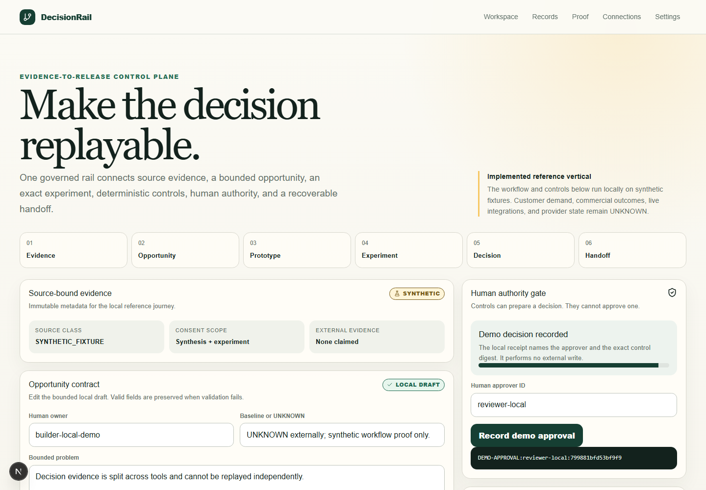
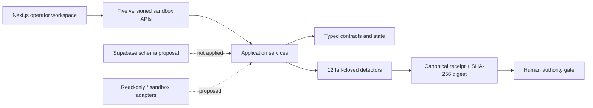

# DecisionRail

DecisionRail is an evidence-to-release control plane for product teams. It connects source evidence, a bounded opportunity, an exact experiment, deterministic validation, a human decision, and a recoverable handoff in one replayable workflow.

This repository contains a working reference vertical, not a marketing prototype. The local application runs 12 known-bad fixtures and 12 clean controls, emits deterministic receipts, blocks when a detector is missing, and keeps consequential approval with a named human.



## Product boundary

| State | What it means |
| --- | --- |
| **Implemented** | Five typed data contracts, five versioned sandbox APIs, 12 evidence-evaluating detectors, 24 synthetic fixtures, deterministic receipts, recovery proof, responsive UI, distinct-human approval and handoff gates, and a proposed Supabase schema with RLS on every table. |
| **Proposed** | Read-only research/analytics adapters, sandbox prototype adapter, production-gated delivery adapter, authenticated tenancy, and provider-backed persistence. |
| **Hypothesis** | A bounded product-decision sprint may improve decision quality or reduce evidence loss and rework. |
| **UNKNOWN** | Customer demand, buyer commitment, willingness to pay, actual costs, outcomes, repeat use, provider configuration, and production readiness. |

DecisionRail is not affiliated with, endorsed by, or presented as work completed for an employer or customer. All demo records are explicitly synthetic.

## User and problem

The primary user is a Product Builder or Product Manager who owns one problem from discovery through outcome. Evidence often lives in research notes, design files, issue trackers, analytics, and meeting decisions that cannot be replayed as one exact chain. DecisionRail makes that chain inspectable and blocks product decisions whose source, version, authority, or recovery path is incomplete.

## The real workflow

1. Capture source metadata, consent scope, redaction state, and an immutable digest.
2. Frame one bounded opportunity with an owner, baseline or `UNKNOWN`, non-goals, evidence links, and expiry.
3. Bind the exact prototype, fixture set, cohort, metric, guardrails, decision rule, and stop conditions.
4. Run all 12 P0 controls against known-bad and clean fixtures.
5. Compare two complete runs; normalized digests must match.
6. Disable each detector evaluator and remove each detector module; acceptance must fail for the intended requirement.
7. Present the evidence to a human approver distinct from the builder.
8. Record a local demo approval and have a non-builder operator accept the recovery-bound synthetic handoff. No external write occurs.

## Architecture



Dependency direction is inward: UI and adapters call application services; services call pure domain contracts and detectors. Domain code has no browser, provider, database, or AI dependency. See [Architecture](docs/ARCHITECTURE.md) and [ADR-001](docs/ADR-001-DETERMINISTIC-VERTICAL.md).

## Deterministic, AI, and human split

- **Deterministic software:** domain-schema evaluation, typed issue codes, canonical serialization, SHA-256 receipts, repeatability, evaluator and module mutation detection, RLS contract checks, and recovery.
- **AI assistance:** not required at runtime. A future AI path may draft only from cited permitted evidence and must remain visibly proposed and reversible.
- **Human authority:** consent, opportunity scope, prototype exposure, experiment start, product decision, production write, rollback, and commercial claims.

The system continues in deterministic/manual mode when AI is absent. Missing or conflicting evidence never becomes success.

## Run locally

Requirements: Node.js 20.9 or newer.

```powershell
git clone https://github.com/shrishmanglik/decision-rail.git
cd decision-rail
npm ci
npm run dev
```

Open `http://127.0.0.1:3000`, validate the seeded opportunity contract, run the 24 controls, enter an approver distinct from `builder-local-demo`, and accept the synthetic handoff as a distinct operator.

No environment variables, credentials, provider accounts, or customer data are required.

## Reproduce the proof

```powershell
npm run typecheck
npm run lint
npm run test
npm run build
npm run test:e2e
npm run test:accessibility
npm run audit:prod
```

The suite covers:

- 24 good/bad acceptance fixtures across CV-R1 through CV-R12;
- two-run digest identity;
- 12 evaluator-disable and 12 missing-module mutations;
- RLS enabled and forced on all eight proposed tables;
- builder/approver/operator segregation and accepted synthetic handoff;
- damaged outcome-lineage recovery;
- desktop and mobile primary journeys;
- automated WCAG A/AA checks.

See the [evidence manifest](docs/EVIDENCE-MANIFEST.md) for exact results and the [operator runbook](docs/OPERATOR-RUNBOOK.md) for retry and recovery.

## Security and privacy

The demo accepts only repository-owned synthetic fixtures. It performs no external mutation and reads no secrets. The proposed Supabase migration:

- enables and forces RLS on every table;
- uses tenant membership plus role-specific policies;
- enforces builder/approver separation in schema and policy;
- revokes update/delete on append-only decisions and receipts;
- contains no service-role or RLS-bypass path.

The migration is not applied anywhere by this build; live schema and policy state are `UNKNOWN`. See [Security and privacy](docs/SECURITY-PRIVACY.md).

## Commercial hypothesis

The commercial wedge is a bounded product-decision pilot for one evidence-fragmented B2B workflow. That is a hypothesis, not validated demand or a public price. Recurring-software claims remain prohibited until paid repeat use, actual delivery cost, independent operation, and buyer acceptance are authenticated.

## Implemented versus roadmap

Implemented now:

- one complete synthetic evidence-to-human-decision-to-accepted-handoff journey;
- 12 versioned detectors and typed rejection receipts;
- responsive application surfaces for workspace, records, proof, connections, and settings;
- explicit empty/pending/blocked/ready states;
- five versioned sandbox API/service boundaries and operator recovery path;
- database/RLS design contract without provider mutation.

Proposed next, subject to separate authority and validated demand:

1. Supabase Auth and provider-applied RLS verification.
2. Signed import/export with redaction and exact-version manifests.
3. Read-only research and analytics adapters.
4. Independently observed design-partner shadow workflow.
5. Production write adapter only after a separate approval and reconciliation contract.

## Evidence integrity

The governed blueprint remains outside this public repository. Its SHA-256 digest is recorded in the evidence manifest so the implementation can be traced without exposing application-package or employer-source material. Local checks prove source behavior only; they do not prove deployment, provider state, customers, commercial outcomes, or revenue.
